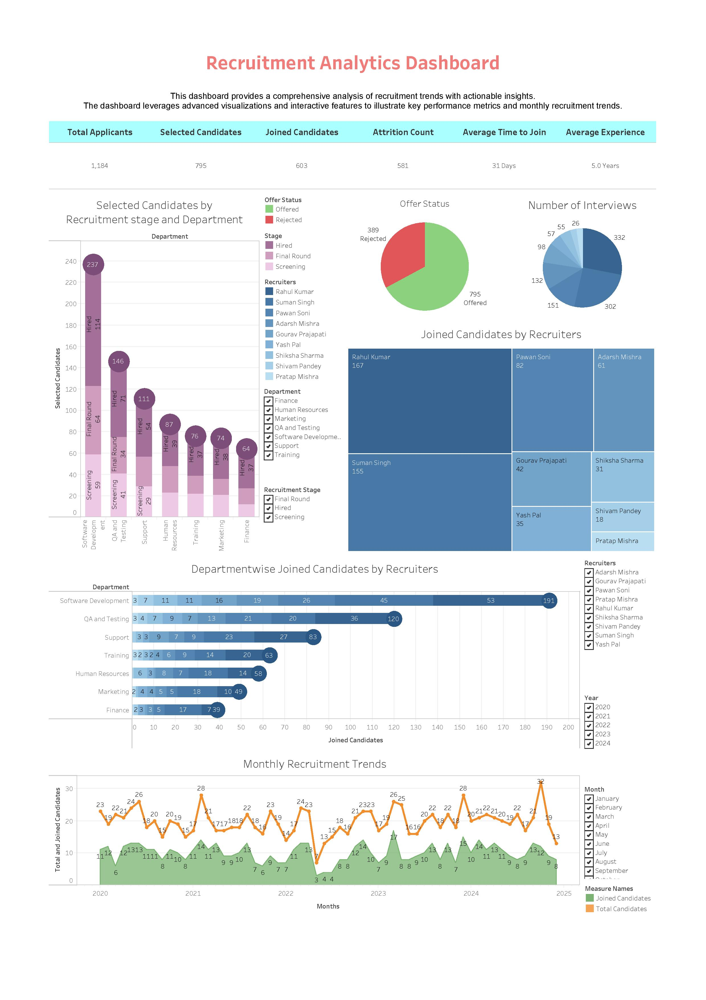

# Talent_Acquisition_Analytics

A **Tableau-based Recruitment Analytics Dashboard** that provides real-time insights into the hiring process. This project focuses on tracking key performance metrics such as:

- **Total Applicants**  
- **Selected and Joined Candidates**  
- **Attrition**  
- **Average Time to Join**  
- **Average Experience**

By visualizing data across different **departments** and **recruiters**, the dashboard aims to improve **offer-to-join conversion rates** and reduce **early attrition** through data-driven decision-making.

---

## Summary

In many organizations, recruitment data is scattered across multiple sources, making it challenging to get a clear, holistic view of the hiring pipeline. This project centralizes recruitment data, allowing hiring managers and HR teams to **quickly identify bottlenecks**, **optimize the hiring funnel**, and **forecast future staffing needs**. The result is a streamlined recruitment process with **reduced time-to-hire** and **improved quality of hires**.

---

## Project Files

| File Name                                | Description                                                                                     |
|------------------------------------------|-------------------------------------------------------------------------------------------------|
| **README.md**                            | This file—provides an overview of the project.                                                  |
| **Recruitment_Analytics_Dashboard.jpg**  | A **screenshot** of the Tableau dashboard showing various charts and key metrics.               |
| **Recruitment_Analytics_Dashboard.twb**  | The **non-packaged** Tableau workbook. Requires data connections (CSV or hyper extract).        |
| **Recruitment_Analytics_Dashboard.pdf**  | The **pdf** file of the Tableau dashboard.                                                      |
| **Recruitment_Dev.csv**                  | A sample dataset containing recruitment data (anonymized).                                      |
| **Recruitment_Dev_Extract.hyper**        | A **Tableau data extract** file used for the dashboard.                                         |

---

## Dashboard Overview

Below is a snapshot of the Tableau dashboard:

The dashboard includes multiple **interactive** visualizations to help stakeholders track and analyze the recruitment funnel:

1. **Selected Candidates by Recruitment Stage and Department**  
   - A **stacked bar chart** that breaks down candidates by their progress (e.g., Applied, Interviewed, Offered, Joined) across different departments.

2. **Joined Candidates by Recruiters**  
   - A **donut or pie chart** illustrating how many candidates joined under each recruiter, helping identify top-performing recruiters.

3. **Department-wise Joined Candidates Over Time**  
   - A **line or bar chart** that shows the timeline of how many candidates joined in each department, highlighting seasonal or monthly trends.

4. **Monthly Recruitment Trends**  
   - A **line chart** depicting monthly fluctuations in total applicants, offers, and joined candidates, allowing quick identification of peaks and troughs in recruitment activity.

5. **Key Performance Indicators (KPIs)**  
   - Metrics like **Attrition Count**, **Average Time to Join**, and **Average Experience** are displayed to give a quick, high-level snapshot of recruitment health.

---

## How to Use

1. **Clone or Download the Repository**  
   - Click the green “Code” button at the top of this GitHub page and either download as a ZIP or clone via Git.

2. **Open the Packaged Workbook (Recommended)**  
   - Use `Recruitment_Analytics_Dashboard.twbx` if you have **Tableau Desktop**. This file contains all the data and visualizations bundled together.

3. **Explore the Dashboard**  
   - In Tableau, navigate through the different sheets and dashboards to see the various charts.  
   - Hover over elements for detailed tooltips, and use filters to drill down into specific departments or recruiters.

4. **Optional: Use the Non-Packaged Workbook**  
   - If you prefer to use the `.twb` file (`Recruitment_Analytics_Dashboard.twb`), ensure you connect it to the **Recruitment_Dev.csv** or **Recruitment_Dev_Extract.hyper** in Tableau so all data sources map correctly.

---

## Visualizations & Insights

1. **Stacked Bar Chart (Stage vs. Department)**  
   - **Insight**: Helps identify which department has the highest volume of candidates at each recruitment stage. This can guide resource allocation or highlight where the process might be slower.

2. **Donut Chart (Joined Candidates by Recruiters)**  
   - **Insight**: Spotlights top recruiters and uncovers patterns—if one recruiter consistently has a higher join rate, their best practices can be replicated across the team.

3. **Line/Bar Chart (Department-wise Timeline)**  
   - **Insight**: Shows trends over time, revealing if certain months or quarters are more active. This can assist in budgeting and planning for peak hiring seasons.

4. **Monthly Recruitment Trends**  
   - **Insight**: Correlate the number of applicants, offers, and hires to external factors (like market conditions, campus hiring seasons, etc.) and forecast future needs.

5. **KPIs (Attrition, Time to Join, Experience)**  
   - **Insight**: Provides an immediate snapshot of how quickly new hires are onboarded (Time to Join), how experienced they are (Average Experience), and how many are leaving early (Attrition). This data helps in refining the recruitment strategy and onboarding processes.

---

## Insights & Results

- **Improved Conversion Rates**: By identifying which stages of the funnel had the highest drop-off, the team was able to implement targeted interventions, resulting in a **noticeable increase in offer-to-join rates**.
- **Reduced Early Attrition**: Tracking candidates post-joining uncovered common reasons for early attrition, prompting policy changes that lowered attrition rates.
- **Optimized Recruiter Performance**: Comparing recruiter success rates helped pinpoint training opportunities and standardize best practices across the recruitment team.
- **Real-time Monitoring**: The dashboard’s user-friendly interface enabled managers to quickly respond to any sudden changes or bottlenecks in the hiring pipeline.

---

## Future Enhancements

1. **Live Data Integration**  
   - Connect to live databases or an Applicant Tracking System (ATS) to automatically refresh the dashboard and provide up-to-the-minute insights.

2. **Predictive Analytics**  
   - Incorporate machine learning models to predict candidate success or attrition likelihood, enabling more proactive hiring decisions.

3. **Role-Based Access**  
   - Restrict or customize views based on user roles (e.g., Recruiters, HR Managers, Executives), ensuring relevant insights are delivered to the right stakeholders.

4. **Advanced Visualizations**  
   - Add Sankey diagrams or network charts to better illustrate candidate flow and recruiter relationships.

---

## Contact

For questions, collaborations, or more information:

- **Email**: [paidikalayesukrishna@gmail.com](mailto:paidikalayesukrishna@gmail.com)  
- **LinkedIn**: [https://www.linkedin.com/in/paidikala-yesukrishna-b00121202/](#)

Feel free to open an **issue** or submit a **pull request** if you have suggestions or wish to contribute!

---

### Thank You!
Thank you for exploring the **Talent_Acquisition_Analytics** project. I hope this dashboard provides valuable insights to improve your recruitment processes and drive better outcomes. If you have any questions or feedback, don’t hesitate to reach out.
